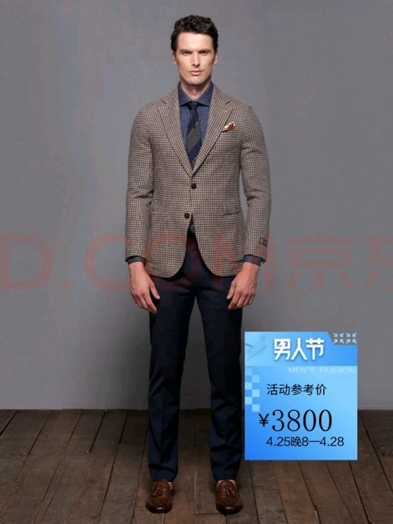
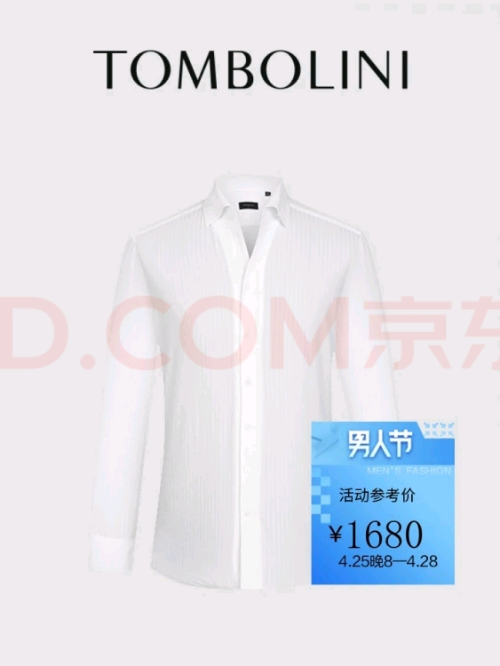
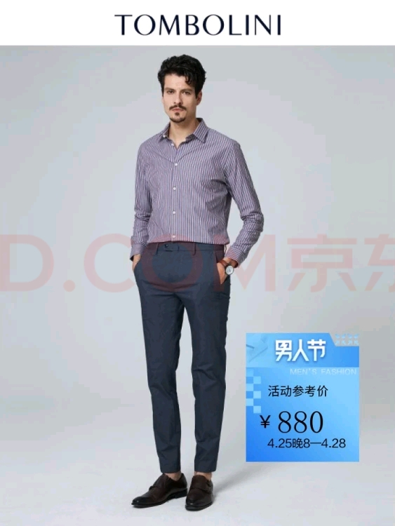

#### 1.Tom Bolini
| 类型 | 款号         | 面料                           | 价格 |
|------|--------------|--------------------------------|------|
| 西服 | XBU64105UDRA | 71.2%绵羊毛,24.1%棉,4.7%山羊绒 | 3800 |
| 衬衫 | XBC71015UDRA | 100%棉                         | 1680 |
| 裤子 | XTD41010UDRA | 96.7%棉，3.3氨纶               | 880  |

#### 2.Maguba
| 类型 | 商品编号       | 用料     | 适用季节 | 零售价 |
|------|:---------------|----------|----------|-------:|
| 皮鞋 | 10044250379468 | 头层牛皮 | 春秋     |   1438 |
| 皮鞋 | 10048178561655 | 头层牛皮 | 夏       |   1568 |

#### 3.Labeouf
| 类型 | 货号      | 用料                    | 颜色   | 零售价 |
|------|-----------|-------------------------|--------|--------|
| 西裤 | LB27889-B | 100%羊毛                | 蓝条   | 1799   |
| 西裤 | LB99689-B | 50.8%羊毛，49.2聚酯纤维 | 深灰色 | 688    |
| 西裤 | LB99889-B | 50.8%羊毛，49.2聚酯纤维 | 深灰色 | 899    |

#### 4.ZERO
| 类型 | 商品编号 | 用料 | 零售价 |
|------|----------|------|--------|
|      |          |      |        |

